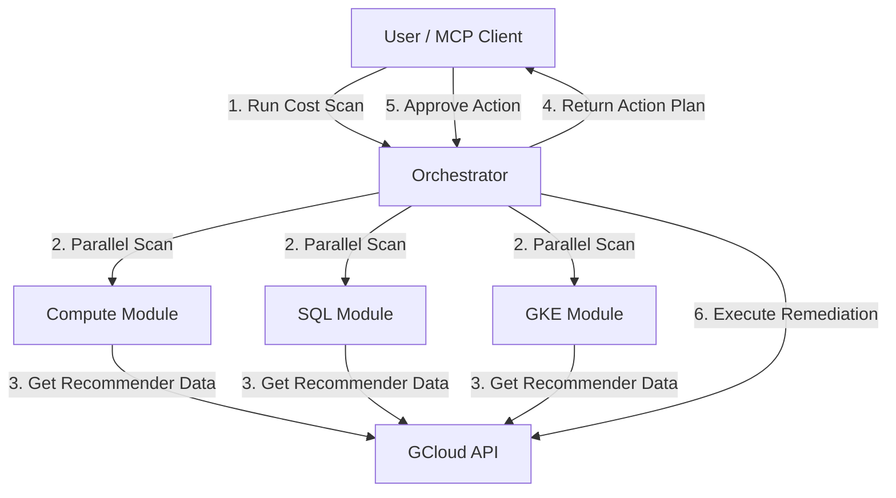

# Strategy: FinOptiAgents Unified Integration

This strategy outlines the architectural approach to integrate exhaustive cost optimization features (Compute, SQL, GKE, Storage) into **FinOptiAgents** in a single consolidated release.

## 1. Architectural Goals
- **Unified Interface**: A single entry point for all cost optimization domains.
- **Extensibility**: Easy to add new recommenders in the future without refactoring core logic.
- **Safety**: "Scan first, act later" model with built-in safeguards against accidental data loss.

## 2. System Design

### 2.1 Core Components

We will structure the solution around a `RecommendationEngine` pattern:

1.  **`RecommenderClient` (Data Layer)**:
    -   Wraps the `gcloud recommender` API.
    -   Handles authentication and region iteration (Global vs. Regional checks).
    -   Normalizes output from different recommenders (e.g., standardizing VM vs. SQL JSON payloads).

2.  **`OptimizationModules` (Logic Layer)**:
    -   **`ComputeOptimizer`**: Handles Idle VMs, Rightsizing, IPs, Disks.
    -   **`DatabaseOptimizer`**: Handles Cloud SQL idle/rightsizing.
    -   **`ContainerOptimizer`**: Handles GKE node pools and autoscaling.
    -   **`StorageOptimizer`**: Handles lifecycle policies and snapshot cleanup.
    -   *Each module implements a standard interface: `scan()`, `verify_safe()`, `remediate()`.*

3.  **`FinOptiOrchestrator` (Control Layer)**:
    -   The main agent interface exposed to MCP.
    -   Aggregates results from all modules.
    -   Applies global policies (e.g., "Never auto-delete in PROD").

### 2.2 Data Flow



## 3. Implementation Strategy

### Phase 1: The Unified Scanner (Read-Only)
**Goal**: Build the data gathering capabilities first.
- Implement `get_cost_recommendations.py` logic into a proper Python class structure.
- **Key Deliverable**: A tool `scan_cost_optimizations` that returns a structured JSON report of *all* potential savings across the 4 domains.

### Phase 2: The Remediation Primitives (Write)
**Goal**: Implement the execution logic for each specific type.
- **Compute**: `stop_instance`, `delete_ip`, `snapshot_and_delete_disk`.
- **SQL**: `patch_instance` (stop/resize).
- **GKE**: `resize_cluster`.
- **Key Deliverable**: Validated atomic tools for each action.

### Phase 3: The Safety & Policy Layer
**Goal**: Prevent disasters.
- Implement **Pre-flight Checks**: Before deleting a disk, check `users` list again.
- Implement **Snapshotting**: Before deleting a VM/Disk, force a snapshot.
- Implement **Dry-Run**: A flag `--dry-run` that outputs the exact `gcloud` command without running it.

## 4. MCP Tools Interface

We will expose high-level tools to the AI agent:

1.  `scan_optimization_opportunities(project_id: str, domains: List[str])`
    -   Returns: Comprehensive list of recommendations with savings estimates.

2.  `generate_remediation_plan(recommendation_ids: List[str])`
    -   Returns: A step-by-step plan (natural language + commands) for fixing the selected issues.

3.  `execute_remediation(plan_id: str, confirmation: bool)`
    -   Performs the actual changes.

## 5. Deployment & Testing Plan
- **Mock Testing**: Use recorded API responses to test logic without touching GCP.
- **Dev Verification**: Run against `vector-search-poc` (your current env) to finding real savings.
- **Production Rollout**: Enable `scan` only first, then enable `execute` with approval gates.

## 6. Savings Calculation Strategy

Accurate reporting of "money saved" is critical. We will **not** attempt to calculate prices manually (which requires complex SKU lookups). Instead, we will rely on the `primaryImpact` data provided directly by the Recommender API.

### 6.1 Data Source
Every recommendation JSON payload from the API contains a standardized cost projection:
```json
"primaryImpact": {
  "category": "COST",
  "costProjection": {
    "cost": {
      "currencyCode": "USD",
      "units": "-15",   // Dollars (negative implies savings)
      "nanos": -500000000 // Cents/fractions
    },
    "duration": "2592000s" // Monthly (30 days)
  }
}
```

### 6.2 Calculation Logic (Pass-through & Aggregate)
1.  **Extraction**: The `RecommenderWrappers` layer will extract `units` and `nanos` from every recommendation.
2.  **Normalization**: Convert to a standard float value: `abs(units + nanos/1e9)`.
3.  **Aggregation**: Sum these values across all detected recommendations to generate **"Total Monthly Potential Savings"**.

### 6.3 Metrics to Track
The `FinOptiOrchestrator` will calculate and report two distinct metrics:
-   **Potential Savings**: The sum of *all* open recommendations found during the scan.
-   **Realized Savings**: The sum of the cost impact of *successfully executed* remediation actions.

This strategy ensures our numbers match exactly what the user sees in the Google Cloud Console Recommendation Hub.
