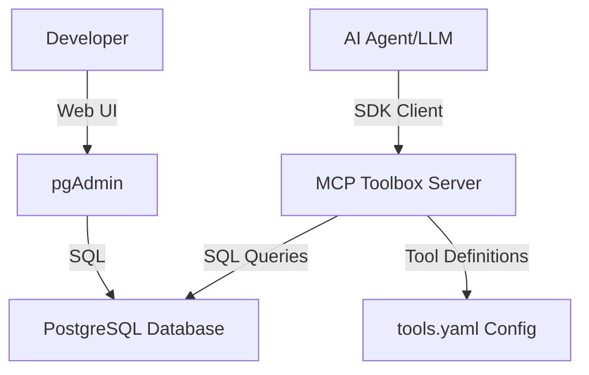
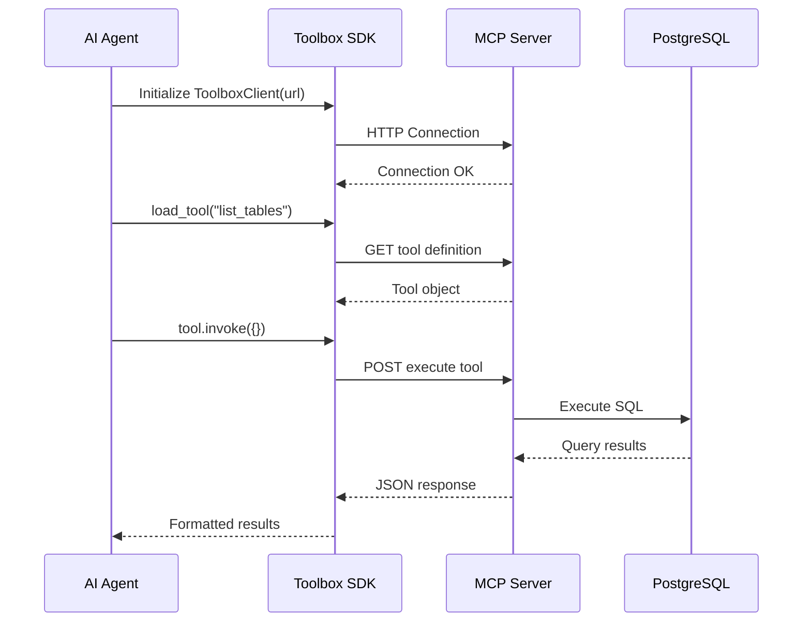

# Google MCP Database Toolbox - Complete Guide

## Table of Contents
1. [Overview](#overview)
2. [MCP Server Architecture](#mcp-server-architecture)
3. [Deployment Setup](#deployment-setup)
4. [How AI Agents Connect](#how-ai-agents-connect)
5. [Configuration Management](#configuration-management)
6. [Testing & Verification](#testing--verification)

---

## Overview

Successfully deployed the Google MCP Toolbox for Databases using the official docker-compose setup. This enables AI agents to query PostgreSQL databases through a standardized Model Context Protocol (MCP) interface.

### Components
- **MCP Toolbox Server**: HTTP service exposing database tools via SDK
- **PostgreSQL Database**: Local postgres instance for data storage
- **pgAdmin**: Web-based database management UI
- **Interactive Client**: Python SDK-based testing tool

---

## MCP Server Architecture

### What is MCP?

The Model Context Protocol (MCP) is a standard for connecting AI applications to external data sources and tools. The Google MCP Toolbox implements this protocol specifically for database access.



### Architecture Components

#### 1. MCP Toolbox Server
- **Image**: `us-central1-docker.pkg.dev/database-toolbox/toolbox/toolbox:0.22.0`
- **Port**: 5001 (host) → 5000 (container)
- **Protocol**: HTTP/REST with SDK client libraries
- **Function**: Translates MCP tool calls into SQL queries

#### 2. Configuration Layer ([config/tools.yaml](file:///Users/robinkv/dev_workplace/all_codebase/mcp-servers/gcloud-mcpserver/google-db-mcp-toolbox/config/tools.yaml))
Defines:
- **Sources**: Database connection parameters
- **Tools**: Available SQL operations exposed to AI agents

#### 3. PostgreSQL Database
- **Image**: `postgres:latest` (linux/amd64)
- **Port**: 5432
- **Data Volume**: `./db` directory for persistence

### How It Works

1. **Tool Definition**: Developer defines SQL tools in `tools.yaml`
2. **Server Startup**: Toolbox reads config and validates database connections
3. **Client Connection**: AI agent initializes SDK client pointing to toolbox URL
4. **Tool Loading**: Client loads available tools from server
5. **Tool Invocation**: Agent calls tools with parameters
6. **SQL Execution**: Toolbox executes SQL against database
7. **Result Return**: Query results returned to agent

---

## Deployment Setup

### Prerequisites
- Docker & Docker Compose installed
- Port 5001 (toolbox) and 5432 (postgres) available

### File Structure
```
google-db-mcp-toolbox/
├── docker-compose.yml     # Service definitions
├── config/
│   └── tools.yaml        # Tool configuration
├── db/                   # PostgreSQL data (auto-created)
└── db_mcp_interactive.py # Test client
```

### Starting Services

```bash
cd /Users/robinkv/dev_workplace/all_codebase/mcp-servers/gcloud-mcpserver/google-db-mcp-toolbox
docker-compose up -d
```

### Stopping Services

```bash
docker-compose down
```

### Checking Status

```bash
docker-compose ps
docker-compose logs toolbox
docker-compose logs db
```

---

## How AI Agents Connect

### Connection Flow



### SDK-Based Integration

#### Python Example (LangChain)

```python
from toolbox_langchain import ToolboxClient

# Initialize client
client = ToolboxClient(url="http://localhost:5001")

# Load tools
tools = client.load_tools()

# Use with LangChain agent
from langchain.agents import create_react_agent

agent = create_react_agent(llm, tools, prompt)
```

#### Python Example (Core SDK)

```python
from toolbox_core import ToolboxClient
import asyncio

async def query_database():
    async with ToolboxClient(url="http://localhost:5001") as client:
        # Load specific tool
        tool = await client.load_tool(name="list_tables")
        
        # Invoke tool
        result = await tool.invoke({})
        print(result)

asyncio.run(query_database())
```

### Available SDKs
- **Python**: `toolbox-core`, `toolbox-langchain`, `toolbox-llamaindex`
- **Node.js**: `@googlecloud/toolbox-langchain`
- **Java**: Maven package
- **Go**: Go module

---

## Configuration Management

### Changing Database Credentials

When database connection parameters change, update [config/tools.yaml](file:///Users/robinkv/dev_workplace/all_codebase/mcp-servers/gcloud-mcpserver/google-db-mcp-toolbox/config/tools.yaml):

#### Current Configuration

```yaml
sources:
  local_postgres:
    kind: postgres
    host: db                    # ← Container hostname
    port: 5432                  # ← Database port
    user: postgres              # ← Database user
    password: postgres          # ← Database password
    database: postgres          # ← Database name
```

#### Updating Configuration

**Step 1**: Edit `config/tools.yaml`

```yaml
sources:
  local_postgres:
    kind: postgres
    host: db                    # Keep as 'db' for docker network
    port: 5432
    user: new_user              # ← Update credentials
    password: new_password      # ← Update credentials
    database: new_database      # ← Update database name
```

**Step 2**: Update database environment in [docker-compose.yml](file:///Users/robinkv/dev_workplace/all_codebase/mcp-servers/gcloud-mcpserver/google-db-mcp-toolbox/docker-compose.yml)

```yaml
db:
  environment:
    POSTGRES_USER: new_user          # ← Match tools.yaml
    POSTGRES_PASSWORD: new_password  # ← Match tools.yaml
    POSTGRES_DB: new_database        # ← Match tools.yaml
```

**Step 3**: Restart services

```bash
docker-compose down
docker-compose up -d
```

### Connecting to External Database

To connect to an external PostgreSQL server instead of the docker container:

#### Option 1: Cloud SQL

```yaml
sources:
  cloud_sql:
    kind: postgres
    host: 10.x.x.x              # Cloud SQL private IP
    port: 5432
    user: cloud_user
    password: cloud_password
    database: production_db
```

#### Option 2: Remote Server

```yaml
sources:
  remote_db:
    kind: postgres
    host: db.example.com        # Remote hostname/IP
    port: 5432
    user: remote_user
    password: remote_password
    database: myapp_db
```

**Note**: For external databases, ensure network connectivity from the docker container.

### Adding New Tools

To expose new SQL operations to AI agents:

```yaml
tools:
  # Existing tools...
  
  get_user_count:
    kind: postgres-sql
    description: Count total users in the system
    source: local_postgres
    statement: SELECT COUNT(*) as user_count FROM users;
  
  search_products:
    kind: postgres-sql
    description: Search products by name
    source: local_postgres
    parameters:
      - name: search_term
        type: string
        description: Product name to search for
    statement: |
      SELECT * FROM products 
      WHERE name ILIKE '%' || {{ .search_term }} || '%'
      LIMIT 10;
```

After adding tools, restart the toolbox container:

```bash
docker-compose restart toolbox
```

---

## Testing & Verification

### Interactive Test Client

Run the SDK-based interactive client:

```bash
python google-db-mcp-toolbox/db_mcp_interactive.py
```

**Commands**:
- `list tables` - List all database tables
- `query SELECT 1` - Run SQL queries
- `help` - Show available commands
- `exit` - Quit

### pgAdmin Access

**URL**: [http://localhost:5050](http://localhost:5050)  
**Credentials**: `admin@example.com` / `admin`

**Connecting to Database**:
- Host: `db` (docker network) or `host.docker.internal` (from host)
- Port: `5432`
- Username: `postgres`
- Password: `postgres`

### Manual SDK Test

```python
from toolbox_core import ToolboxClient
import asyncio

async def test():
    async with ToolboxClient(url="http://localhost:5001") as client:
        tool = await client.load_tool(name="list_tables")
        result = await tool.invoke({})
        print(result)

asyncio.run(test())
```

---

## Troubleshooting

### Server Not Starting

**Check logs**:
```bash
docker-compose logs toolbox
```

**Common issues**:
- Invalid `tools.yaml` syntax
- Database connection failure
- Port 5001 already in use

**Solution**: Verify configuration and restart:
```bash
docker-compose down
docker-compose up -d
```

### Database Connection Errors

**Symptoms**: "Connection refused" or "Authentication failed"

**Solutions**:
1. Verify database is healthy: `docker-compose ps`
2. Check credentials match in both `tools.yaml` and `docker-compose.yml`
3. Wait for database to fully start (check healthcheck)

### Tool Not Found

**Symptoms**: `load_tool()` fails with "tool not found"

**Solutions**:
1. Verify tool name matches exactly in `tools.yaml`
2. Restart toolbox after config changes
3. Check for YAML syntax errors

---

## Key Learnings

### Why Docker Compose?
- **Recommended approach** per Google's official documentation
- Manages both toolbox and database as integrated services
- Automatic health checks and dependency management
- Data persistence through volumes

### Platform Compatibility
- Using `linux/amd64` images on Apple Silicon works via Rosetta
- Volume mount at `/var/lib/postgresql` (not `/var/lib/postgresql/data`) for Postgres 18+
- Port 5001 used to avoid macOS Control Center conflict on port 5000

### SDK vs Direct HTTP
- Toolbox requires SDK client libraries
- Direct REST API calls not supported
- Use `toolbox-core` for custom Python integrations
- Use `toolbox-langchain` for LangChain agents

---

## Next Steps

1. **Configure for Production**: Update credentials, use secrets management
2. **Add Custom Tools**: Define SQL operations specific to your schema
3. **Integrate with AI Agent**: Use LangChain/LlamaIndex SDKs
4. **Monitor Usage**: Check toolbox logs for query patterns
5. **Scale Database**: Move to Cloud SQL for production workloads
